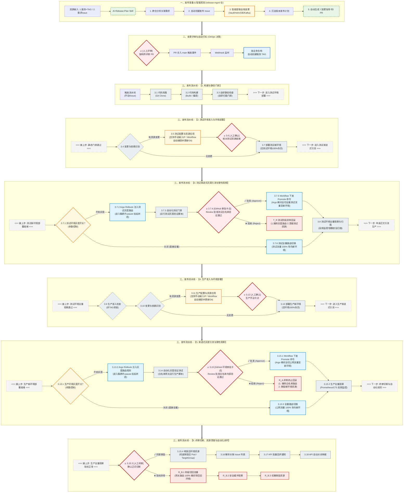

为了在架构图中完美体现「玩法 A（GitHub Actions 的 Environment Approvals 卡点控制集群内 Argo Rollouts 晋升）」**的黄金组合，我们需要对**三、发布流水线的【3. 测试渐进式灰度引流与弹性观察】和【5. 渐进式灰度引流与弹性观察】中的人工确认及全切节点进行像素级更新。

这里通过清晰的节点命名与动作描述，凸显出 **“GitHub 负责卡点与下发命令，Argo Rollouts 负责集群内执行全切”** 的分布式协作逻辑。

以下是更新后的完整 Mermaid 源码：

---

### 💡 关键改动点逻辑对齐说明：

* **测试开启灰度阶段**：
* `3.7.2` 节点明确写为 `Argo Rollouts 注入测试灰度路由 (进入集群内 pause 挂起状态)`。
* `3.7.4` 变更为 `[GitHub 审批卡点] Review 批准测试白名单验证通过`。
* `3.7.5` 全切动作细化为 `Workflow 下发 Promote 命令 (Argo 瞬间全切全量测试流量至新环境)`。
* 失败路由判定也相应改为了 `拒绝 (Reject)`。

* **生产开启灰度阶段**：
* 与测试环境达成严丝合缝的逻辑镜像，`3.13.2` 注入规则后自动进入 `pause 挂起`。
* `3.15` 人工卡点升级为 `[GitHub 环境审批卡点] Review 批准白名单内部验证通过`。
* `3.15.1` 全切动作升级为 `Workflow 下发 Promote 命令 (Argo 瞬间全切公网流量至新环境)`。

这样一来，整条流水线在具备**手动输入 IP 灵活性**的同时，又具备了**玩法 A 声明式 GitOps 编排**的硬核技术质感。
